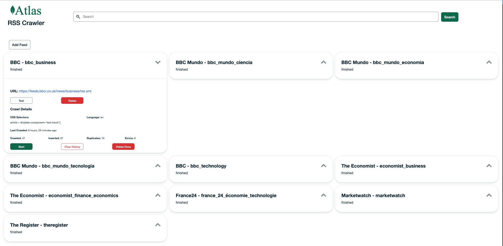

# What is this?
Crawler to ingest RSS feeds and linked pages into MongoDB Atlas.

# Tech Stack
- Frontend: NodeJs
- APIs: Flask
- Backend: Python
- Database: MongoDB Atlas

# How can I run it?
First you will need to set your database connection string and optional database name (defaults to 'news-demo') in `.env`. There is an example of how to name your variables in [`example.env`](./example.env). Also add API keys for the embedding service.

After that you can either install everything to a local environment or use docker.

Once everything is running you can access the frontend at http://localhost:3000/



## Local Install
```
./install.sh
```
Set up dependencies - like chromium and chromedriver.
```
./runLocal.sh
```
Starts the required processes using supervisord.

## Docker

### Pull: Docker container from public repo
```
./runDocker.sh
```

This pulls the latest image hosted at [johnunderwood197/rsscrawler](https://hub.docker.com/r/johnunderwood197/rsscrawler) and runs it locally in a container. This uses `docker pull` which should automatically pull the correct image for your architecture (amd64 or arm64).

### Build: Docker image and run container locally.
```
./buildRunDockerLocal.sh
```

Will build a docker image and then run it in a local container.

### Publish: build and push multi-arch images to your docker repository
```
./buildAndPush.sh
```

This creates multi-arch images (linux/amd64 and linux/arm64) and pushes them to a repo of your choice. Due to some architecture-dependant binaries this project makes use of [docker's ability to build for multiple architectures](https://docs.docker.com/build/building/multi-platform/#cross-compilation).

# Further Questions..

## Okay. How does it work?
The application uses a few very cool packages to read an RSS feed, open the reference web pages, and parse the html. I am very grateful to (amongst a host of other amazing projects you can find listed [here](./backend/requirements.txt), [here](./backend/package.json) and [here](./frontend/package.json)):

[feedparser](https://feedparser.readthedocs.io/en/latest/#)

[Beautiful Soup](https://beautiful-soup-4.readthedocs.io/en/latest/#)

[Selenium](https://www.selenium.dev/selenium/docs/api/py/index.html)

[Pat's VectorStream Embedder](https://github.com/patw/VectorStream)

## Tell me more...
The app is split into a backend and frontend. The backend is written in python and provides a processor which reads a queue of crawl tasks as well as flask API to handle requests.

## Tell me more about the task queue.
The data layer for the app is MongoDB Atlas. Configurations for the RSS feeds to crawl are stored in a 'feeds' collection. When an API request to start a feed crawl is received a new task is created in the 'queue' collection. The processor polls this collection every second and when a new task is detected it reads the configuration and starts a crawl process.

## So what happens in a 'crawl process'
During the crawl the target RSS feed url is access and all items in the feed parsed. Each item has a link to a web page which is then opened by the crawler script and the contents parse to extract more data. All this data for each RSS item is then indexed as separate documents in the 'docs' collection. Finally, the status of the crawl is saved as log in the 'logs' collection. In the feeds collection the current crawl log is always saved on the originating feed configuration under the 'crawl' field.

## Can I stop a crawl that's happening?
Yes! The stop API creates a stop task with the PID for the running crawl (which is saved in the orignation feed config). This PID is used to stop the appropriate crawl process.

## So there might be more than one crawl process?
Yes. The processor script uses multiprocessing to spawn a new process for each task.
